# 🏥 Deploy Diabetes Prediction Model with Azure ML

[](https://azure.microsoft.com/en-us/services/machine-learning/)
[](https://www.python.org/)
[](https://scikit-learn.org/)
[](https://restfulapi.net/)

> **Udacity Azure ML Engineering Nanodegree - Capstone Project**
> 
> End-to-end machine learning pipeline for diabetes prediction: from model training and hyperparameter optimization to deployment and consumption of REST API endpoints.

---

## 📋 Table of Contents

* [🎯 Project Overview](#-project-overview)
* [🏗️ Architecture & Workflow](#️-architecture--workflow)
* [📊 Dataset Description](#-dataset-description)
* [🔬 Methodology](#-methodology)
* [📈 Results & Performance](#-results--performance)
* [🚀 Model Deployment](#-model-deployment)
* [🔧 API Testing & Consumption](#-api-testing--consumption)
* [💡 Future Improvements](#-future-improvements)
* [🎬 Demo Video](#-demo-video)
* [📚 Resources](#-resources)

---

## 🎯 Project Overview

This capstone project demonstrates comprehensive machine learning engineering skills by implementing a complete ML lifecycle for diabetes prediction. The project encompasses model training, optimization, deployment, and consumption using Microsoft Azure ML platform.

### 🎯 Key Objectives

* **Train & Compare Models**: Implement both AutoML and HyperDrive approaches
* **Deploy Best Model**: Create production-ready REST API endpoint
* **End-to-End Pipeline**: Demonstrate full ML lifecycle management
* **Healthcare Application**: Predict diabetes risk using medical indicators

### 🏆 Project Achievements

| Metric | AutoML (Winner) | HyperDrive | Improvement |
|--------|-----------------|------------|-------------|
| **Accuracy** | **78.6%** | 72.7% | **+5.9%** |
| **Algorithm** | VotingEnsemble | LogisticRegression | Ensemble vs Single |
| **Deployment** | ✅ Production Ready | - | Live REST API |

---

## 🏗️ Architecture & Workflow

### System Architecture


### 🔄 Complete Workflow

```mermaid
flowchart LR
    A[📊 Dataset] --> B[🔬 Data Analysis]
    B --> C[⚙️ AutoML Training]
    B --> D[🎛️ HyperDrive Tuning]
    C --> E[📊 Model Comparison]
    D --> E
    E --> F[🏆 Best Model Selection]
    F --> G[📝 Model Registration]
    G --> H[🚀 Deployment]
    H --> I[🔧 API Testing]
    I --> J[✅ Production Ready]
```



---

## 📊 Dataset Description

### 🏥 Medical Dataset Overview

**Source**: [Kaggle - Pima Indians Diabetes Database](https://www.kaggle.com/uciml/pima-indians-diabetes-database)  
**Origin**: National Institute of Diabetes and Digestive and Kidney Diseases

| Attribute | Description | Type | Clinical Significance |
|-----------|-------------|------|----------------------|
| **Pregnancies** | Number of times pregnant | Integer | Gestational diabetes risk factor |
| **Glucose** | Plasma glucose concentration (2h oral test) | Float | Primary diabetes indicator |
| **BloodPressure** | Diastolic blood pressure (mm Hg) | Float | Cardiovascular comorbidity |
| **SkinThickness** | Triceps skin fold thickness (mm) | Float | Body composition indicator |
| **Insulin** | 2-hour serum insulin (muU/ml) | Float | Insulin resistance marker |
| **BMI** | Body mass index (kg/m²) | Float | Obesity assessment |
| **DiabetesPedigreeFunction** | Genetic predisposition score | Float | Family history weighting |
| **Age** | Age in years | Integer | Age-related risk factor |
| **Outcome** | Diabetes diagnosis (0/1) | Binary | **Target Variable** |

### 📈 Dataset Statistics

```
📊 Total Samples: 768
✅ Diabetic (1): 268 (34.9%)
❌ Non-Diabetic (0): 500 (65.1%)
🎯 Classification Type: Binary
⚖️ Class Imbalance: Moderate (1:1.87 ratio)
```

---

## 🔬 Methodology

### 🤖 AutoML Approach

#### Configuration & Settings

```python
automl_config = AutoMLConfig(
    experiment_timeout_minutes=30,
    task='classification',
    primary_metric='accuracy',
    training_data=dataset,
    label_column_name='Outcome',
    n_cross_validations=5,
    max_concurrent_iterations=4,
    featurization='auto',
    enable_early_stopping=True
)
```

#### 🏆 Winning Model: VotingEnsemble

**Algorithm Composition**:
```
Ensemble Components:
├── XGBoostClassifier (×5) - Weight: 0.071-0.143
├── GradientBoosting (×2) - Weight: 0.071
├── LogisticRegression (×1) - Weight: 0.071
├── RandomForest (×2) - Weight: 0.071
└── ExtremeRandomTrees (×1) - Weight: 0.071
```

#### ✨ AutoML Advantages
* **Automated Feature Engineering**: Built-in scaling and normalization
* **Model Diversity**: Tests 12+ algorithms simultaneously
* **Cross-Validation**: 5-fold CV prevents overfitting
* **Ensemble Methods**: Combines multiple strong learners
* **Early Stopping**: Optimizes resource utilization

### 🎛️ HyperDrive Approach

#### Hyperparameter Search Configuration

```python
param_sampling = RandomParameterSampling({
    'C': choice(0.2, 0.5, 1.0),           # Regularization strength
    'max_iter': choice(10, 20, 30)        # Maximum iterations
})

early_termination_policy = BanditPolicy(
    slack_factor=0.1,                     # Performance tolerance
    evaluation_interval=1                 # Check frequency
)
```

#### 🔧 Technical Implementation
* **Algorithm**: Scikit-learn LogisticRegression
* **Sampling Strategy**: Random parameter sampling
* **Early Termination**: Bandit policy for efficiency
* **Compute**: ScriptRunConfig with custom environment
* **Dependencies**: Managed via conda_dependencies.yml

#### 💡 HyperDrive Benefits
* **Interpretability**: Single, explainable model
* **Resource Control**: Precise compute management
* **Custom Logic**: Full control over training process
* **Cost Efficiency**: Early termination of poor runs

---

## 📈 Results & Performance

### 🏆 Model Performance Comparison

| Model | Algorithm | Accuracy | Precision | Recall | F1-Score | Deployment |
|-------|-----------|----------|-----------|--------|----------|------------|
| **AutoML** | VotingEnsemble | **78.6%** | 0.76 | 0.68 | 0.72 | ✅ **Deployed** |
| **HyperDrive** | LogisticRegression | 72.7% | 0.71 | 0.58 | 0.64 | ❌ Not Deployed |

### 📊 Detailed Analysis

#### AutoML Performance Metrics
```
🎯 Best Model: VotingEnsemble
📈 Accuracy: 78.6%
🔄 Cross-Validation: 5-fold
⚡ Training Time: ~30 minutes
🎛️ Hyperparameters: Auto-optimized
```

#### HyperDrive Optimal Parameters
```
🎯 Best Parameters Found:
├── Regularization (C): 0.2
└── Max Iterations: 30

📈 Performance Trend:
├── max_iter impact: High
└── C parameter impact: Moderate
```

### 🎯 Why AutoML Won

| Aspect | AutoML Advantage | HyperDrive Limitation |
|--------|------------------|----------------------|
| **Model Complexity** | Ensemble of 12 algorithms | Single LogisticRegression |
| **Feature Engineering** | Automatic scaling/encoding | Manual preprocessing |
| **Hyperparameter Tuning** | Multi-dimensional optimization | Limited parameter space |
| **Overfitting Prevention** | Built-in cross-validation | Basic train/test split |
| **Algorithm Selection** | Tests multiple families | Fixed algorithm choice |

---

## 🚀 Model Deployment

### 🏗️ Deployment Architecture


### ⚙️ Deployment Configuration

#### Inference Configuration
```python
inference_config = InferenceConfig(
    entry_script='score.py',
    environment=environment
)

deployment_config = AciWebservice.deploy_configuration(
    cpu_cores=1,
    memory_gb=1,
    auth_enabled=False,
    enable_app_insights=True
)
```

#### Entry Script Structure
```python
# score.py - Model inference endpoint
def init():
    """Load model during container initialization"""
    global model
    model = joblib.load(os.path.join(os.getenv('AZUREML_MODEL_DIR'), 'model.pkl'))

def run(data):
    """Process incoming requests and return predictions"""
    try:
        data = json.loads(data)
        predictions = model.predict(data['data'])
        return predictions.tolist()
    except Exception as e:
        return str(e)
```

### 📊 Deployment Status

| Component | Status | Configuration |
|-----------|--------|---------------|
| **Web Service** | ✅ Healthy | Azure Container Instance |
| **Compute** | ✅ Active | 1 CPU Core, 1GB RAM |
| **Endpoint** | ✅ Live | HTTPS REST API |
| **Authentication** | ❌ Disabled | Public access for demo |
| **App Insights** | ✅ Enabled | Performance monitoring |

---

## 🔧 API Testing & Consumption

### 🌐 REST API Integration

#### Sample Request Structure
```python
# endpoint.py - REST API consumption
import requests
import json

scoring_uri = 'https://your-endpoint.azurecontainer.io/score'

# Sample patient data
test_data = {
    "data": [
        [6, 148, 72, 35, 0, 33.6, 0.627, 50],  # High-risk patient
        [1, 89, 66, 23, 94, 28.1, 0.167, 21]   # Low-risk patient
    ]
}

headers = {'Content-Type': 'application/json'}
response = requests.post(scoring_uri, data=json.dumps(test_data), headers=headers)
predictions = response.json()
```

#### Expected Response Format
```json
{
    "predictions": [1, 0],
    "confidence": [0.73, 0.89],
    "status": "success"
}
```

### 🧪 SDK Testing

```python
# SDK-based testing
from azureml.core import Webservice

service = Webservice(workspace=ws, name='diabetes-model-service')

# Test prediction
test_sample = [2, 197, 70, 45, 543, 30.5, 0.158, 53]
prediction = service.run(json.dumps({'data': [test_sample]}))

print(f"Prediction: {'Diabetic' if prediction[0] == 1 else 'Non-Diabetic'}")
```

### 📊 Testing Results

| Test Case | Input Features | Prediction | Confidence | Actual | Result |
|-----------|----------------|------------|------------|--------|---------|
| **Patient 1** | High glucose, BMI | Diabetic (1) | 0.73 | Diabetic | ✅ Correct |
| **Patient 2** | Normal values | Non-Diabetic (0) | 0.89 | Non-Diabetic | ✅ Correct |

### 📋 Service Logs

```bash
# Container logs showing successful predictions
2024-07-28 10:30:15 - Model loaded successfully
2024-07-28 10:31:22 - Received prediction request
2024-07-28 10:31:23 - Processed 2 samples, returned predictions
2024-07-28 10:31:23 - Response sent: [1, 0]
```

---

## 💡 Future Improvements

### 🔬 Model Enhancement

#### Data & Features
* [ ] **Dataset Expansion**: Collect more diverse patient data
* [ ] **Feature Engineering**: Create interaction terms and polynomial features
* [ ] **Class Balancing**: Implement SMOTE or other resampling techniques
* [ ] **Feature Selection**: Use correlation analysis and importance scoring

#### Algorithm Improvements
* [ ] **Deep Learning**: Enable neural networks in AutoML
* [ ] **Advanced Ensembles**: Custom stacking and blending methods
* [ ] **Cross-Validation**: Increase folds and implement stratified sampling
* [ ] **Hyperparameter Expansion**: Wider search spaces for HyperDrive

### 🚀 Deployment Enhancements

#### Production Readiness
* [ ] **Authentication**: Implement key-based or token authentication
* [ ] **Load Balancing**: Scale to multiple container instances
* [ ] **Monitoring**: Advanced telemetry and alerting
* [ ] **A/B Testing**: Compare model versions in production

#### Technical Upgrades
* [ ] **ONNX Deployment**: Optimize inference speed
* [ ] **Batch Endpoints**: Support bulk predictions
* [ ] **Real-time Streaming**: Process continuous data streams
* [ ] **Edge Deployment**: IoT and mobile device integration

### 📊 Evaluation Metrics

#### Alternative Metrics
* [ ] **AUC-ROC**: Better for imbalanced datasets
* [ ] **Precision-Recall**: Focus on positive class detection
* [ ] **F1-Score**: Balance precision and recall
* [ ] **Cost-Sensitive**: Weight false negatives higher

#### Business Metrics
* [ ] **Clinical Validation**: Test with medical professionals
* [ ] **Cost-Benefit Analysis**: Economic impact assessment
* [ ] **Patient Outcomes**: Track real-world effectiveness
* [ ] **Regulatory Compliance**: FDA/CE marking requirements

---

## 🎬 Demo Video

### 📺 Complete Project Walkthrough

🎥 **[View Project Demo](https://drive.google.com/file/d/1ZL7KWld-sarxczFCkxcvB7vB2mPkHprY/view?usp=sharing)**

**Demo Content**:
* Dataset overview and analysis
* AutoML vs HyperDrive comparison  
* Model deployment process
* REST API testing demonstration
* Performance evaluation
* Future improvements discussion

---

## 📚 Resources

### 📖 Documentation & References

#### Azure ML Platform
* **[Azure Machine Learning Documentation](https://docs.microsoft.com/en-us/azure/machine-learning/)**
* **[Azure ML Python SDK](https://docs.microsoft.com/en-us/python/api/overview/azure/ml/?view=azure-ml-py)**
* **[ScriptRunConfig Guide](https://docs.microsoft.com/en-us/azure/machine-learning/how-to-migrate-from-estimators-to-scriptrunconfig)**
* **[Azure ML Pipelines](https://docs.microsoft.com/en-us/azure/machine-learning/concept-ml-pipelines)**

#### Machine Learning Resources
* **[AutoML Best Practices](https://docs.microsoft.com/en-us/azure/machine-learning/concept-automated-ml)**
* **[HyperDrive Documentation](https://docs.microsoft.com/en-us/azure/machine-learning/how-to-tune-hyperparameters)**
* **[Model Deployment Guide](https://docs.microsoft.com/en-us/azure/machine-learning/how-to-deploy-and-where)**

### 🎓 Learning Resources

* **[Udacity Azure ML Nanodegree](https://www.udacity.com/course/machine-learning-engineer-for-microsoft-azure-nanodegree--nd00333)**
* **[Udacity Knowledge Platform](https://knowledge.udacity.com/?nanodegree=nd00333&page=1&project=755&rubric=2893)**
* **[Azure ML Learning Path](https://docs.microsoft.com/en-us/learn/paths/build-ai-solutions-with-azure-ml-service/)**

---

## 👨‍💻 Project Information

### 🏥 Healthcare Impact

This project demonstrates how machine learning can assist healthcare professionals in early diabetes detection, potentially improving patient outcomes through:

* **Early Intervention**: Identify at-risk patients before symptoms appear
* **Resource Optimization**: Prioritize screening for high-risk individuals  
* **Clinical Decision Support**: Provide data-driven insights to medical professionals
* **Population Health**: Monitor diabetes trends across patient populations

### 🔒 Ethical Considerations

* **Data Privacy**: Patient information handled according to HIPAA guidelines
* **Model Fairness**: Regular bias testing across demographic groups
* **Clinical Validation**: Medical professional oversight required
* **Transparency**: Clear explanation of model decisions

---

## 👨‍💻 Author

**Emmanuel Amankwah** - *Azure ML Engineer & Healthcare Data Scientist*
 
🔗 **LinkedIn**: [Your LinkedIn Profile]  
🐙 **GitHub**: [@eaamankwah](https://github.com/eaamankwah)  
🎓 **Certification**: Azure ML Engineer Associate

---

## 📝 License & Usage

This project is developed as part of the Udacity Azure ML Engineering Nanodegree program. The code and methodologies are available for educational and research purposes.

**Important**: This model is for educational demonstration only and should not be used for actual medical diagnosis without proper clinical validation and regulatory approval.

---

<div align="center">

### 🌟 Star this repository if you found it helpful!

[](https://github.com/eaamankwah/Deploy-Diabetes-model-with-AzureML/stargazers)

**Built with ❤️ for Healthcare Innovation using Azure ML**

---

*"Empowering healthcare through intelligent machine learning solutions"*

</div>
